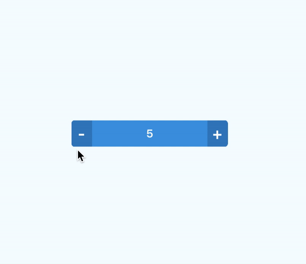

<h1 align="center">

<p align="center">
  
</p>

<p align="center">
  <a href="https://www.npmjs.com/package/react-native-number-stepper"></a>
  <a href="https://github.com/prscX/react-native-number-stepper/pulls"></a>
  <a href="https://github.com/prscX/react-native-number-stepper#License"></a>
</p>


    ReactNative: Number Stepper (Android/iOS)

If this project has helped you out, please support us with a star 🌟
</h1>

A stepper with a sliding label in the middle. Pan the label or tap the buttons.


## 📖 Getting started

`$ npm install react-native-number-stepper --save`


## 💻 Usage

```javascript
import { RNNumberStepper } from 'react-native-number-stepper';

```

## 💡 Props


| Prop              | Type       | Default | Note                                                                                                       |
| ----------------- | ---------- | ------- | ---------------------------------------------------------------------------------------------------------- |
| `size`       | `number`     |   `1`      | Specify the size of stepper
| `width`       | `number`     |   `150`      | Specify the width of stepper
| `height`       | `number`     |   `35`      | Specify the height of stepper
| `value`       | `array`     |   `0`      | Specify the default value fo stepper
| `minValue`       | `number`     |    `0`     | Specify the minimum value limit of stepper
| `maxValue`       | `number`     |    `10`     | Specify the maximum value limit of stepper
| `stepValue`       | `number`     |    `1`     | Specify the incremental value of stepper
| `autoRepeat`       | `string`     |   `true`      | Specify the auto repeat flag value
| `leftButtonText`       | `string`     |   `-`      | Specify the left button display text
| `rightButtonText`       | `string`     |   `+`      | Specify the right button display text
| `buttonsTextColor`       | `string`     |   `#FFFFFFFF`      | Specify the button text color
| `buttonsBackgroundColor`       | `string`     |   `#357FC0`      | Specify the buttons background color
| `labelTextColor`       | `string`     |   `#FFFFFF`      | Specify the label text color
| `labelBackgroundColor`       | `string`     |   `#4098E0`      | Specify the label background color
| `buttonsContainerWidth`       | `number`     |   `50`      | Specify the buttons container width
| `cornorRadius`       | `number`     |   `8`      | Specify the cornor radius value
| `borderWidth`       | `number`     |   `0`      | Specify the border width of stepper
| `borderColor`       | `string`     |   `#FFFFFF`      | Specify the border color of stepper
| `onChange`       | `func`     |   ``      | Specify function for the onChange event listener


## ✨ Credits

## 🤔 How to contribute
Have an idea? Found a bug? Please raise to [ISSUES](https://github.com/prscX/react-native-number-stepper/issues).
Contributions are welcome and are greatly appreciated! Every little bit helps, and credit will always be given.

## 💫 Where is this library used?
If you are using this library in one of your projects, add it in this list below. ✨


## 📜 License
This library is provided under the Apache License.

RNNumberStepper @ [prscX](https://github.com/prscX)

## 💖 Support my projects
I open-source almost everything I can, and I try to reply everyone needing help using these projects. Obviously, this takes time. You can integrate and use these projects in your applications for free! You can even change the source code and redistribute (even resell it).

However, if you get some profit from this or just want to encourage me to continue creating stuff, there are few ways you can do it:
* Starring and sharing the projects you like 🚀
* If you're feeling especially charitable, please follow [prscX](https://github.com/prscX) on GitHub.

  <a href="https://www.buymeacoffee.com/prscX" target="_blank"></a>

  Thanks! ❤️
  <br/>
  [prscX.github.io](https://prscx.github.io)
  <br/>
  </ Pranav >